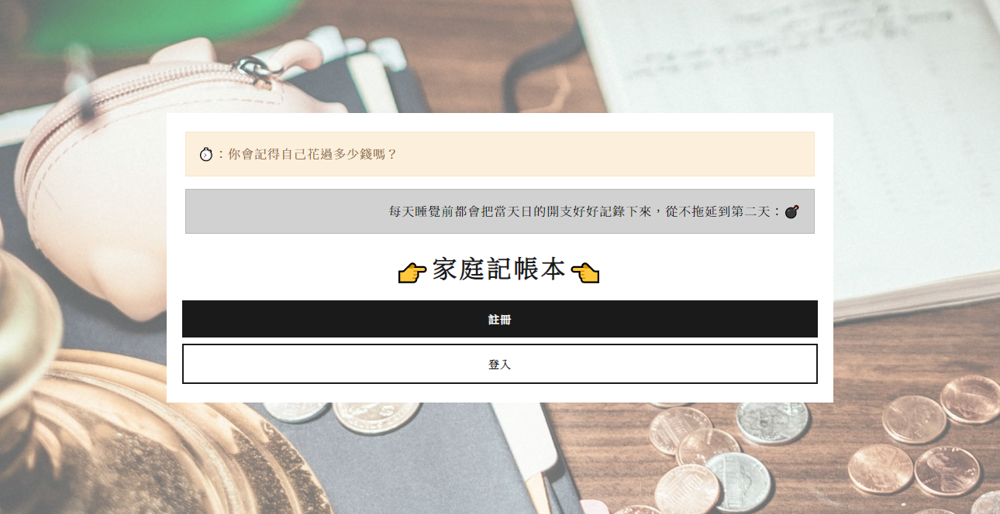

# Alpha Camp 2-3 作業：老爸的私房錢

## 功能介紹
- 使用者可使用Facebook帳號登入本專案
- 帳目記錄：目前可記錄帳目名目、類別、日期、金額與消費商家
- 支援修改或刪除已記錄的帳目
- 可根據月份與類別篩選帳目
- 提供以月份為統計單位的各類別開銷圖表
- 可將還未刪除的帳目下載為Excel格式之檔案

## 環境需求
- [git](https://git-scm.com/downloads)
- [Node.js](https://nodejs.org/en/)
- [npm](https://www.npmjs.com/get-npm)

## 開啟流程
1. `git clone https://github.com/tzynwang/expense-tracker.git`
1. `cd expense-tracker`
1. 從[此份表單](https://forms.gle/snW4HTyYxoh5BURq6)取得FB ID與金鑰資訊
1. `code .`開啟本專案，將根目錄`.env.example`檔案中列為SKIP的部分替換為透過步驟3取得的相關ID與金鑰內容
1. 將`.env.example`檔案名稱修改為`.env`
1. `npm install`
1. `npm run seed`
1. `npm run start`
1. 待終端機出現「`Express is listening on localhost:3000/welcome`」字樣後，即可使用瀏覽器開啟本專案：[http://localhost:3000/welcome](http://localhost:3000/welcome)

## 銘謝
- [Dziana Hasanbekava: Coins scattered on desk with papers and creative pig wallet](https://www.pexels.com/photo/coins-scattered-on-desk-with-papers-and-creative-pig-wallet-7063762/)：專案首頁主視覺圖片
- [BOOTSWATCH: Lux](https://bootswatch.com/lux/)：專案CSS模板

## 開發者
Charlie (Tzu Yin)
- Email: tzyn.wang💰gmail.com（💰→@）
- Blog: [普通文組](https://tzynwang.github.io/)

## 無駄
- 關於專案首頁兩句文案的起源，可搜尋「你記得你至今吃了多少塊麵包嗎」與「絕不把疲勞和壓力留到第二天」